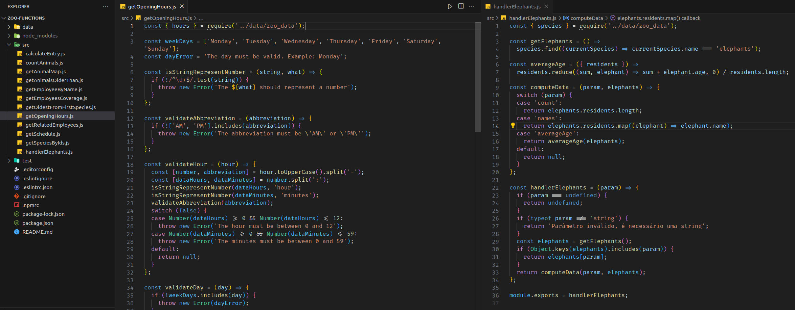

# README: Zoo functions



## Project Description

This was the final project while learning the basics, and it proved to be the most challenging. The purpose of this application is to create functions for searching within an array of objects containing information about a zoo. The goal was to return formatted data.

### Technologies

- LINUX
- VSCODE
- JAVASCRIPT
- JEST

### What I Learned

- How to search in a array of objects
- How to filter information from an object and use it in another function

## How to Run the Project

1. Clone the repository:

   ```bash
   git clone https://github.com/feduarte-dev/zoo-functions
   ```

2. Navigate to the project directory:

   ```bash
   cd your-repository
   ```

3. Install dependencies:

   ```bash
   npm install
   ```

4. Test the application:

   ```bash
   npm run test
   ```

## Contributions

[Felipe](https://www.linkedin.com/in/feduarte-dev/) - /src - /test


[Trybe](https://www.betrybe.com/) - Everything else
